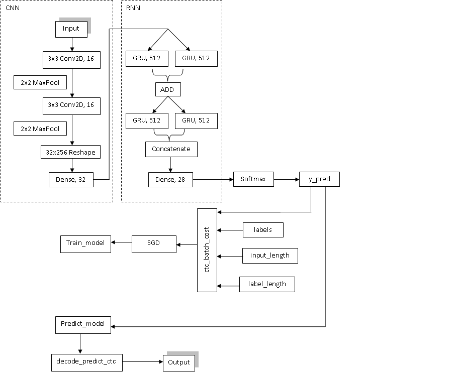

# Optical Character Recognition 
 The combination of Convolutional Neural Network and Recurrent Neural Network builds a model which has the ability to recognize a sequence of characters from images.
 
## Convolutional Neural Network
Convolutional layers and fully connected layers extract the data and classify into N-classes input.   

## Recurrent Neural Network
RNN is a collection of GRU (or LSTM) blocks, GRU comprise of update gate, reset gate, current memory content and final memory which used to handle the probability of inputs and return a sequence information.     

## Architecture Design
Referring to [Keras-image-ocr](https://github.com/Tony607/keras-image-ocr) reading a lot of useful information from data images.

